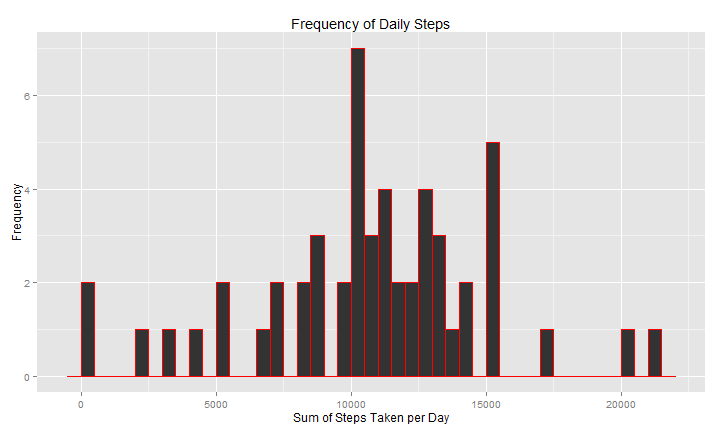
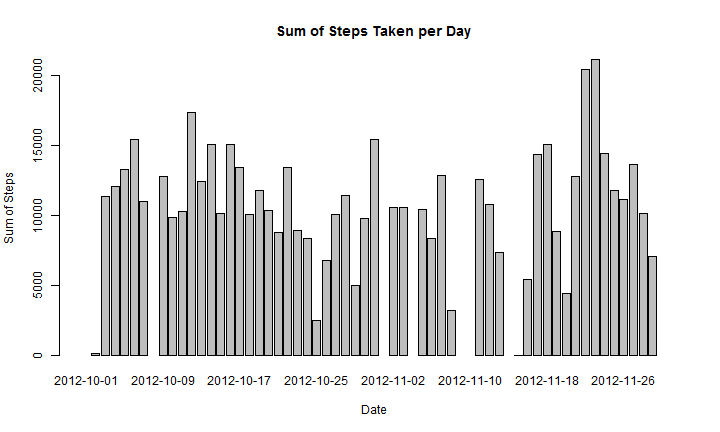
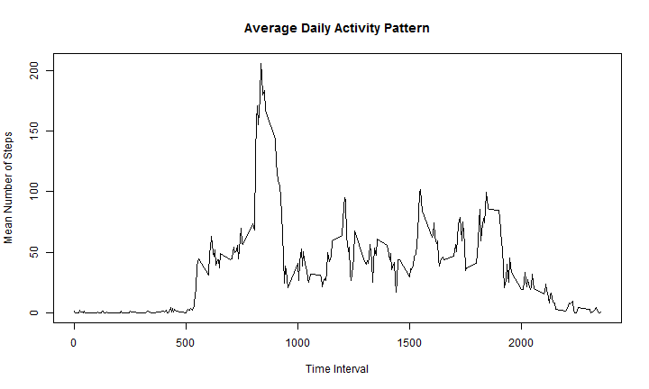
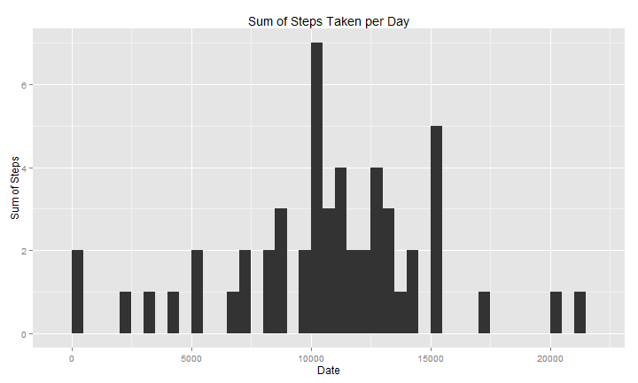
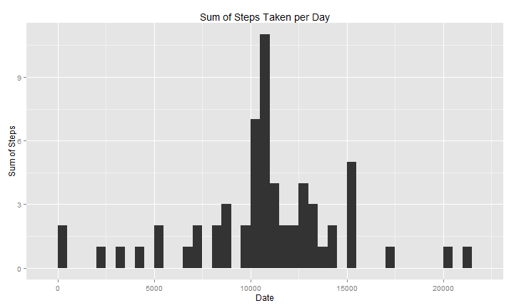
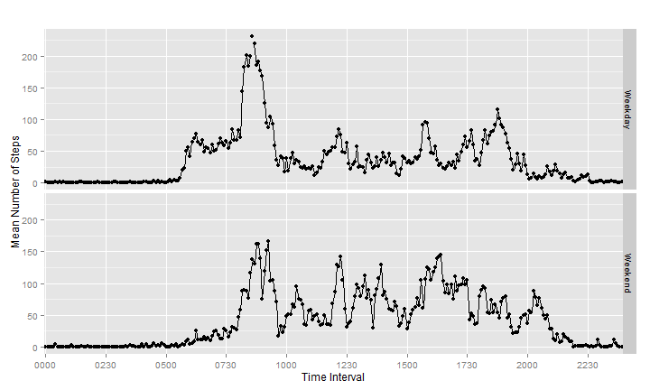

## Loading and preprocessing the data

### 1. Load the data (i.e. ```read.csv()```)


```r
    rm(list=ls())
    
    csv <- read.csv("activity.csv")
```

### 2. Process/transform the data (if necessary) into a format suitable for your analysis

In addition to setting global options, the time field is padded with zeros for a uniform 4-character field width.
    

```r
    knitr::opts_chunk$set(fig.width=10, 
                   fig.height=6,
                   echo=TRUE)

    require(stringr)
    require(ggplot2)
    csv$interval <- str_pad(csv$interval, 4, pad = "0") 
```


## What is mean total number of steps taken per day?

*For this part of the assignment, you can ignore the missing values in the dataset.*

### 1. Make a histogram of the total number of steps taken each day

The ```tapply``` function is used to add the number of steps measured each day, and storing the daily totals in an array called ```stepsByDay```.  


```r
    stepsByDay <- tapply(csv$steps, as.Date(csv$date), sum)
```

The histogram below summarizes the number of occurrences, or frequencies, of the Total Steps per Day (*y-axis*) , grouped into 500-step intervals (*x-axis*). In contrast, a bar plot is more appropriate for visualizing the total steps (*y-axis*) in relation to time (*x-axis*). Both plots of ```stepsByDay``` are included below to illustrate the difference.


```r
    qplot(stepsByDay, binwidth = 500,
         main = "Frequency of Daily Steps",
         col = I("red"),
         xlab = "Sum of Steps Taken per Day",
         ylab = "Frequency"
         )
```

 

```r
    barplot(stepsByDay, 
         main = "Sum of Steps Taken per Day",
         xlab = "Date",
         ylab = "Sum of Steps"
         )
```

 

### 2. Calculate and report the mean and median total number of steps taken per day


```r
    meansteps <- mean(stepsByDay, na.rm = TRUE)

    mediansteps <- median(stepsByDay, na.rm = TRUE)
    
    c(meansteps, mediansteps)
```

```
## [1] 10766.19 10765.00
```

With the summarized data already available in the ```stepsByDay```array, the ```mean``` and ```median``` functions are useful. The results for the mean and median total number of steps taken per day are **10766.19** and **10765**, respectively. 

## What is the average daily activity pattern?

### 1. Make a time series plot (i.e. ```type = "l"```) of the 5-minute interval (x-axis) and the average number of steps taken, averaged across all days (y-axis).

The line plot below shows the mean number of steps for each of the five minute intervals.


```r
    stepsByTime <- aggregate(csv$steps, list(csv$interval), mean, na.rm = TRUE)    
    names(stepsByTime) <- paste(c("interval", "steps"))
    
    plot(stepsByTime, type = 'l',
         main = "Average Daily Activity Pattern",
         xlab = "Time Interval",
         ylab = "Mean Number of Steps"
    )
```

 


### 2. Which 5-minute interval, on average across all the days in the dataset, contains the maximum number of steps?

```r
    maxSteps <- max(stepsByTime$steps)

    peakSteps <- stepsByTime[stepsByTime$steps == maxSteps,]

    peakSteps
```

```
##     interval    steps
## 104     0835 206.1698
```

The time interval with the maximum average number of steps is **0835**, with an average of **206.1698113** steps.


## Imputing missing values

### 1. Calculate and report the total number of missing values in the dataset (i.e. the total number of rows with ```NA```s)

```r
    numNAs <- sum(is.na(csv$steps))
    numNAs
```

```
## [1] 2304
```

There are **2304** ```NA``` values in the dataset.

### 2. Devise a strategy for filling in all of the missing values in the dataset. The strategy does not need to be sophisticated. For example, you could use the mean/median for that day, or the mean for that 5-minute interval, etc.

```NA``` values are imputed with the mean value for that particular five minute interval. Since the number of steps is a discrete form of data, imputed values are rounded to the nearest whole number.

### 3. Create a new dataset that is equal to the original dataset but with the missing data filled in.

The mean number of steps per five minute interval are already stored in the data frame ```stepsByTime```. Therefore, imputing the missing values is a simple process of matching the interval of a missing value with the corresponding mean value in ```stepsByTime```.


```r
    newcsv <- csv

    newcsv$steps <- ifelse(is.na(newcsv$steps),
                        stepsByTime$steps[match(newcsv$interval, stepsByTime$interval)],
                        newcsv$steps)
    
    newcsv$steps <- round(newcsv$steps, digits = 0)
```


### 4. Make a histogram of the total number of steps taken each day and Calculate and report the mean and median total number of steps taken per day. 

For ease of comparison, two plots are shown below. The top plot is the same histogram from question 1, which ignores the missing values in the dataset. The bottom plot is the histogram that includes the values imputed using the interval-mean strategy described in the previous section.


```r
    par(mfrow = c(1, 2))    

    qplot(stepsByDay, binwidth = 500,
         main = "Sum of Steps Taken per Day",
         sub = "(NAs excluded)",
         xlab = "Date",
         ylab = "Sum of Steps"
         )
```

 

```r
    stepsByDay <- tapply(newcsv$steps, as.Date(newcsv$date), sum)

    qplot(stepsByDay, binwidth = 500,
         main = "Sum of Steps Taken per Day",
         sub = "(NAs replaced)",
         xlab = "Date",
         ylab = "Sum of Steps"
         )        
```

 


```r
    newmeansteps <- mean(stepsByDay, na.rm = TRUE)

    newmediansteps <- median(stepsByDay, na.rm = TRUE)

    c(meansteps, newmeansteps, '\t',
      mediansteps, newmediansteps)
```

```
## [1] "10766.1886792453" "10765.6393442623" "\t"               
## [4] "10765"            "10762"
```

####    - Do these values differ from the estimates from the first part of the assignment? 

####    - What is the impact of imputing missing data on the estimates of the total daily number of steps?

There are slight differences in the plot and the total mean/median estimates that are visible upon close examination. Substituting the five-minute interval
means for the ```NA``` values--instead of omitting them--changes the total daily mean from **10766.19** to **10765.64**, and the median from **10765** to **10762**.

## Are there differences in activity patterns between weekdays and weekends?

*For this part the ```weekdays()``` function may be of some help here. Use the dataset with the filled-in missing values for this part.*

Based on the plots below, the activity patterns during the weekdays seem to spike during the morning, noon, and evening time intervals, and are lower during the working hours. In contrast, activity patterns during the weekend tend to have more spikes--though smaller in magnitude--that are spread throughout the waking hours.


###     1. Create a new factor variable in the dataset with two levels -- "weekday" and "weekend" indicating whether a given date is a weekday or weekend day.

```r
wkday <- function(x) {
    
    if(x %in% c("Monday", "Tuesday", "Wednesday", "Thursday", "Friday")){
       res <- "Weekday"
    } else if(x %in% c("Saturday", "Sunday")) {
        res <- "Weekend"
    } else {
        res <- "Other"
    }
    
    res
}

newcsv$daytype <- as.factor(sapply(weekdays(as.Date(newcsv$date)), wkday))
```


###     2. Make a panel plot containing a time series plot (i.e. ```type = "l"```) of the 5-minute interval (x-axis) and the average number of steps taken, averaged across all weekday days or weekend days (y-axis).


```r
## Subset by weekday/weekend, then average number of steps by time interval
stepsByType <- aggregate(.~daytype+interval, newcsv, mean)

qplot(interval, steps, data = stepsByType,
    main = "",
    xlab = "Time Interval",
    ylab = "Mean Number of Steps",
    facets = daytype ~ .,
    ) + 
    geom_line(position=position_jitter(.1),aes(group=daytype)) + 
    ylim(0, max(stepsByType$steps)) +
    scale_x_discrete(breaks = stepsByType$interval[seq(1, length(stepsByType$interval), 60)])
```

 
